# Getting Started

---

## Download and Start

Download a release from the [release page](https://github.com/power-flow-analyzer/PowerFlowAnalyzer/releases)
(e.g. [PowerFlowAnalyzer-2.3.0.zip](https://github.com/power-flow-analyzer/PowerFlowAnalyzer/releases/download/2.3.0/PowerFlowAnalyzer-2.3.0.zip)) and unzip the file. A new folder `PowerFlowAnalyzer-<VERSION>` will be created. The final name is version dependant (e.g. `PowerFlowAnalyzer-2.3.0`).

Open the newly created folder and execute the start script in Matlab:
```matlab
>> pfa_start_application.m
```
The graphical user interface (GUI) will open in a new window:
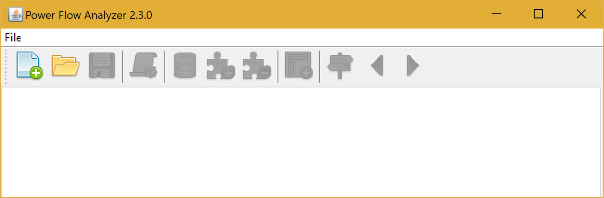

## Open an example project

Click the  button on the toolbar. A new window will open. 

Select or enter the path to the project file `<PATH TO PFA>/examples/matpower/matpower.case` of your PFA installation. Click `OK`.

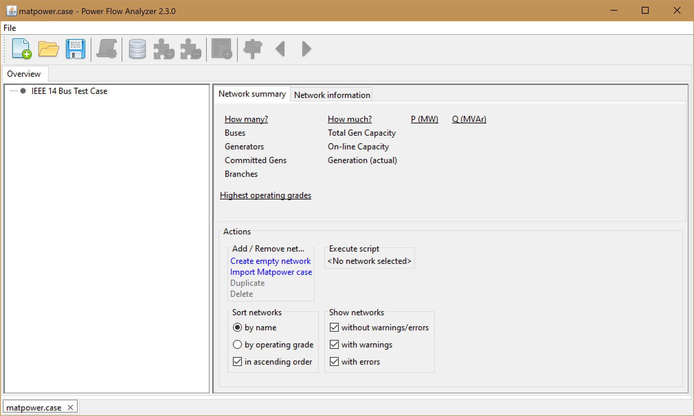

Select the item `IEEE 14 Bus Test Case` in the `Overview` area on the left side. The item will be highlighted. A network summary similar to Matpower will be show:

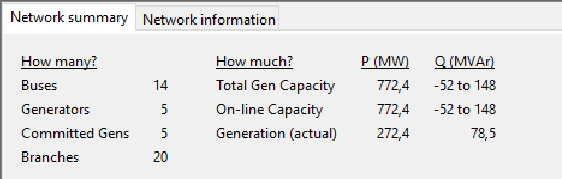

You can change the name of a network and add a description in the `Network information` tab:

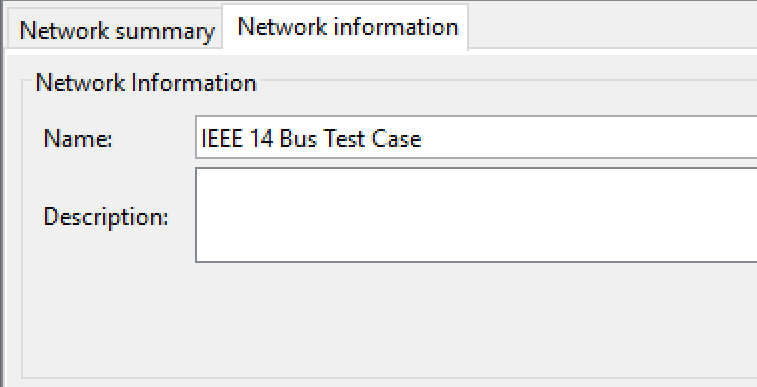

By double clicking an item in the `Overview` area, the network will be shown:
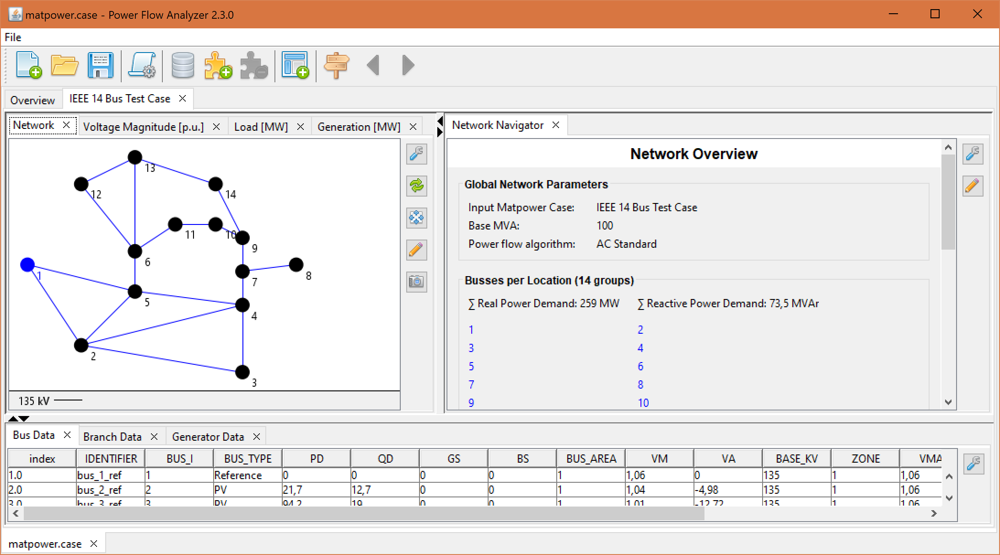

The user interface offers basically three different visualisation types for network data:

* _network maps_ drawing grid topology data and heat maps
* _network browsers_ allowing to explore data in a hyperlink like style
* _data tables_ listing specific elements and their parameters

Selecting an item in a visualisation will update all other visualisations to reflect the current selection. 

## Compute power flow with Matpower

Click the  button on the toolbar. A dialog will open and show the available scripts. Click on `2. Calculate Power Flow`.

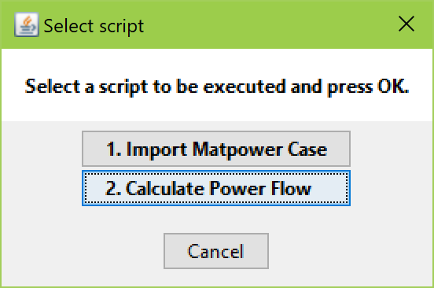

The script parameter dialog will show up. Select `AC Standard` as the power flow algorithm. Click `OK`.

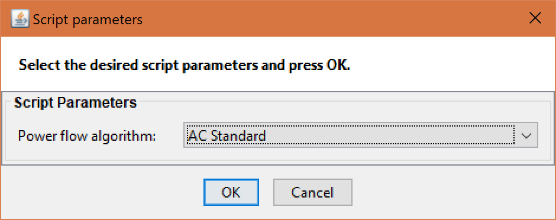

This particular script will perform the following actions:

* convert network data into the Matpower case format
* compute power flow using Matpower functions
* convert calculation results into network data
* update user interface

Take a look at the Matlab console to view the logging output of the PFA and Matpower functions. 

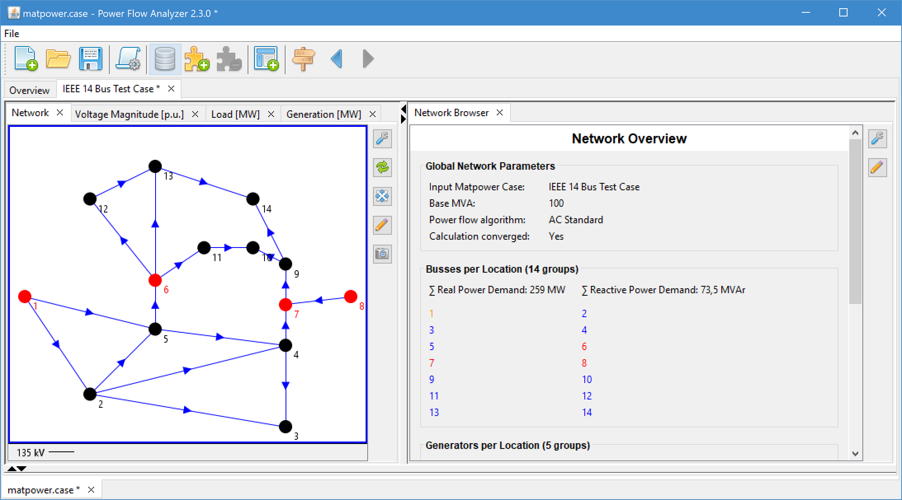

Click on one of the red dots in the network viewer to see which constraint was violated:

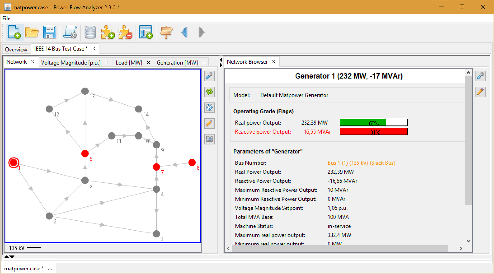


## Load other IEEE Test Cases

Switch back to the `Overview` panel and select the action `Create empty network`:

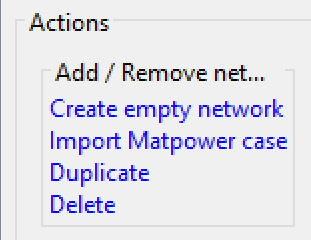

Now execute the script `1. Import Matpower Case`:

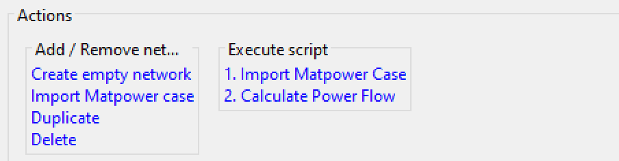

The script parameter dialog will show up. Select an input Matpower case (e.g. `IEEE 30 Bus Test Case`). Click `OK`.

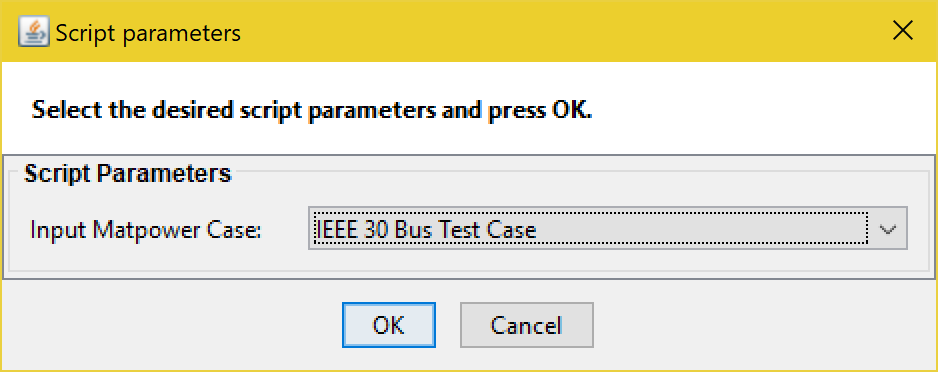

Select the newly created network in the list, change its name and view it by double clicking on it's list item.

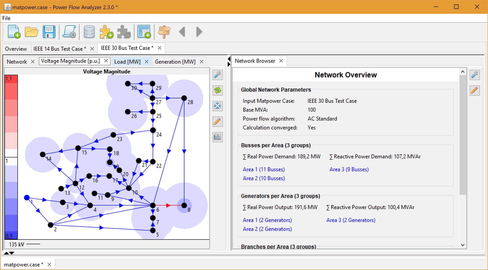

Grouping assets by specific models or parameters may reduce significantly the information shown in the user interface. Take a look at the bus section in the `Network Overview`:

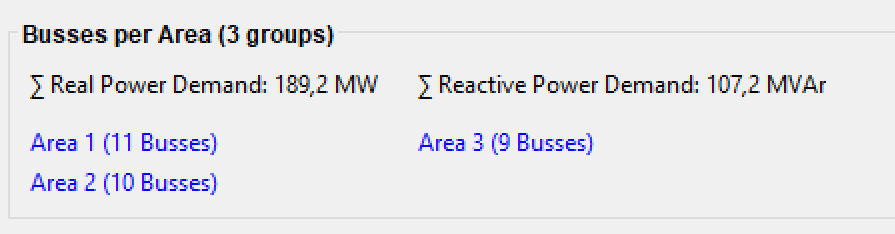

Clicking on one of these items will select/highlight the items in this group:

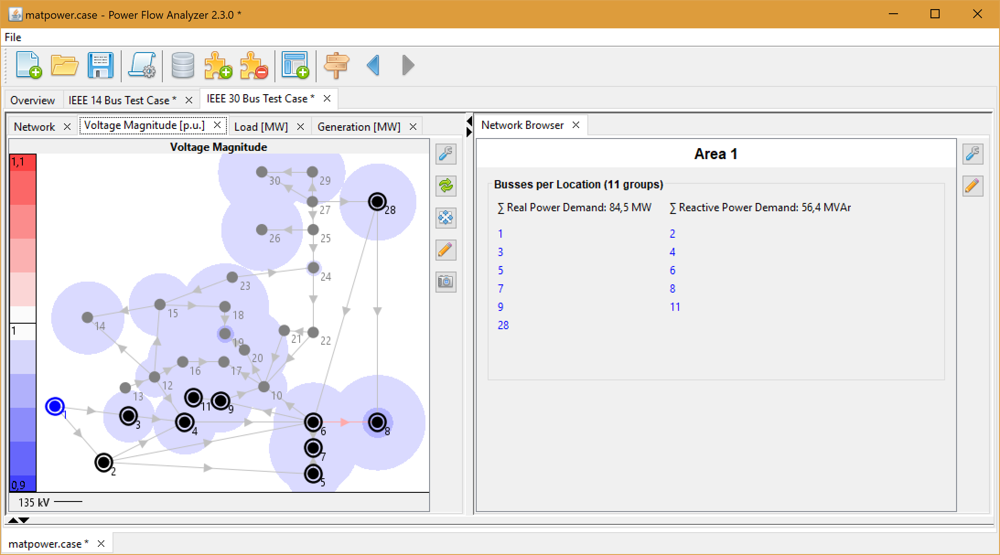
